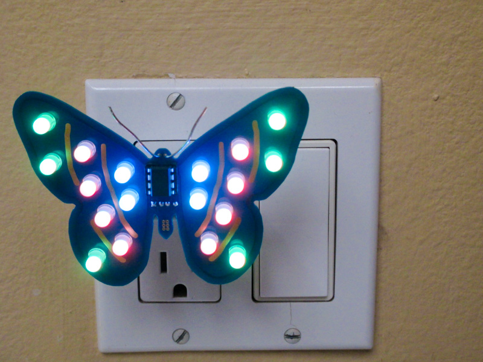

This repository contains the [KiCad][5] and [Gerber][6] files for a
PCB nightlight shaped like a butterfly.

The nightlight contains 18 "NeoPixel" (WS-2812) LEDs, controlled by an
ATtiny85 microcontroller.  (The firmware for the microcontroller is in
[a separate repository][7].)

There is a tiny potentiometer on the back, which can be used to
control the brightness.  (This functionality is handled in software,
so it could potentially be repurposed, such as to control speed or
color instead.)

## Bill of Materials

* D1-D18 (qty 18) - 5mm through-hole NeoPixel.  SparkFun part
  no. [COM-12986](https://www.sparkfun.com/products/12986).  Digi-Key
  part no. [1568-1213-ND](https://www.digikey.com/product-detail/en/sparkfun-electronics/COM-12986/1568-1213-ND/5673799).
* U1 (qty 1) - ATtiny85 microcontroller.  Atmel part
  no. ATTINY85-20PU.  Digi-Key part no. [ATTINY85-20PU-ND](https://www.digikey.com/product-detail/en/microchip-technology/ATTINY85-20PU/ATTINY85-20PU-ND/735469).
* U1 (qty 1) - 8-pin DIP socket.  Assmann part no. A 08-LC-TT.
  Digi-Key part no. [AE9986-ND](https://www.digikey.com/product-detail/en/assmann-wsw-components/A-08-LC-TT/AE9986-ND/821740).
* J1 (qty 1; optional) - 6-pin 0.050" header.  Sullins part
  no. GRPB032VWVN-RC.  Digi-Key part no [S9015E-03-ND](https://www.digikey.com/product-detail/en/sullins-connector-solutions/GRPB032VWVN-RC/S9015E-03-ND/1786453).
* J2 (qty 1) - USB A plug.  Molex part no. 0480370001.  Digi-Key part
  no. [WM17117-ND](https://www.digikey.com/product-detail/en/molex-llc/0480370001/WM17117-ND/857603).
* C1 (qty 1) - 0.1µF 0805 capacitor.  AVX part no. 08055C104KAT2A.
  Digi-Key part no. [478-1395-1-ND](https://www.digikey.com/product-detail/en/avx-corporation/08055C104KAT2A/478-1395-1-ND/564427).
* C2 (qty 1) - 10µF 0805 capacitor.  Kemet part no. C0805C106K8PACTU.
  Digi-Key part no. [399-4925-1-ND](https://www.digikey.com/product-detail/en/kemet/C0805C106K8PACTU/399-4925-1-ND/1090920).
* R1 (qty 1) - 470 Ohm 0805 resistor.  Rohm part no. ESR10EZPJ471.
  Digi-Key part no. [RHM470KCT-ND](https://www.digikey.com/product-detail/en/rohm-semiconductor/ESR10EZPJ471/RHM470KCT-ND/1763027).
* R2 (qty 1) - 10k Ohm 0805 resistor.  Susumu part no. RR1220P-103-D.
  Digi-Key part no. [RR12P10.0KDCT-ND](https://www.digikey.com/product-detail/en/susumu/RR1220P-103-D/RR12P10.0KDCT-ND/432854).
* POT1 (qty 1) - 10k Ohm potentiometer.  Bourns part no. TC33X-2-103E.
  Digi-Key part no. [TC33X-103ECT-ND](https://www.digikey.com/product-detail/en/bourns-inc/TC33X-2-103E/TC33X-103ECT-ND/612911).
* [Bare wire, 20 AWG](https://smile.amazon.com/gp/product/B01BDB8240/).
* [USB power adapter with USB A receptacle](https://smile.amazon.com/gp/product/B06Y2H4RJ6/).

## Tools

* Standard soldering tools.
* Tiny AVR Programmer.  SparkFun part
  no. [PGM-11801](https://www.sparkfun.com/products/11801).  Digi-Key
  part no. [1568-1079-ND](https://www.digikey.com/product-detail/en/sparkfun-electronics/PGM-11801/1568-1079-ND/5230948).
* Computer with [Arduino IDE](https://www.arduino.cc/en/Main/Software)
  installed.

## Circuit board

Most fabs should work fine, but I chose [JLCPCB][1].  I chose blue
soldermask for my first set of boards, but red or yellow might work,
as well.  I chose the [ENIG][2] finish.

If you're not making any changes to the board, all you need to do is
zip up the files in the `gerber` directory, and upload the zipfile to
JLCPCB.

Note that in the KiCad files and Gerber files, the "front" of the
board is actually the back, and vice-versa. This is because JLCPCB
adds a customer ID number to the front of the board, but I wanted the
number to be on the actual back of the board, where it doesn't disrupt
the esthetics of the nightlight.

## Assembly

1. Solder the surface-mount components C1, C2, R1, R2, and POT1 onto
the back of the board.

2. Solder the USB plug onto the back of the board.  The plug is meant
to be used at a right angle, so some surgery is required.  Use
needle-nose pliers to bend the pins so that they are straight, rather
than at a right angle.  Insert the pins through the holes in the
board.  Use Scotch tape to hold the plug in place.  Trim the pins just
a little bit, so they don't protrude quite so far through the board.
Solder the pins to the board.  Remove the Scotch tape from the back.
Then, create a bead of solder all the way around where the plug
touches the board on the back, to hold it in place firmly.

3. Solder the 8-pin DIP socket to the front of the board.  The
"U"-shaped indentation should point toward the top of the butterfly.

4. Solder the 18 LEDs to the front of the board.  The LED should be
positioned so that the square pad gets one of the longer legs, not one
of the shorter ones.

5. Create the butterfly's antennae by inserting a length of bare wire
into the holes on the butterfly's head.  (These two holes are
represented by J3 on the schematic.)  It's a tight fit, so friction
may be enough to hold the wire in place, but you can always solder it
to be sure.

6. Program [the firmware][7] into the ATtiny85 chip.

7. Insert the ATtiny85 into the socket on the butterfly.  The dot on
the chip should be in the upper-left corner.

8. Plug the butterfly into the USB power adapter.

9. Plug the power adapter into the wall.

## ISP Header

Probably the easiest way to program the ATtiny85 is by removing the
chip and inserting it into the Tiny AVR Programmer.  However, if you
wish to program the ATtiny85 in-circuit, J1 has the pinout of a
[standard 6-pin ISP header][8], designed to be mounted on the back of the
board.  Although it has the standard pinout, J1 is half the pitch of a
standard ISP header, so you'll need an adapter.

## License

This design is licensed under the
[Creative Commons Attribution-ShareAlike 4.0 International license][12].

Some of the footprints in `myLibrary.pretty` are based on footprints
in the [KiCad library][14], which is licensed under the
[KiCad library license][15] (which is now also CC-BY-SA-4.0, with an
exception).  The footprint in `digikey-footprints.pretty` is a
modified version of a footprint from the [Digi-Key KiCad library][3],
which is licensed under [the same terms][4] as the KiCad library.

[1]: https://jlcpcb.com/quote
[2]: https://en.wikipedia.org/wiki/Electroless_nickel_immersion_gold
[3]: https://github.com/digikey/digikey-kicad-library
[4]: https://github.com/digikey/digikey-kicad-library/blob/master/LICENSE.md
[5]: http://kicad-pcb.org/
[6]: https://en.wikipedia.org/wiki/Gerber_format
[7]: https://github.com/ppelleti/butterfly-fw
[8]: http://www.batsocks.co.uk/readme/isp_headers.htm
[12]: https://creativecommons.org/licenses/by-sa/4.0/
[14]: https://github.com/KiCad/kicad-footprints
[15]: https://forum.kicad.info/t/kicad-library-licensing/7856
